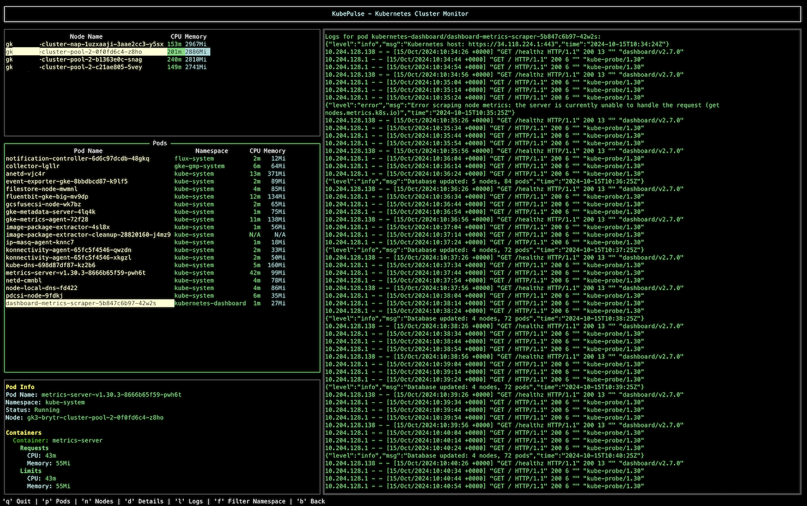

# KubePulse - Kubernetes Cluster Monitor (TUI)


KubePulse is a terminal-based user interface (TUI) for monitoring Kubernetes clusters. This CLI provides an interactive way to view pod statuses, resource usage (CPU and memory), logs, and more, all from the comfort of your terminal.



## Features

- 🌟 View Pods: List all pods running in a selected namespace with detailed resource usage.
- 🌐 View Nodes: Display all nodes in the cluster along with their CPU and memory metrics.
- 📜 View Logs: Inspect logs for any selected pod.
- 🔄 Filter by Namespace: Quickly switch between namespaces to monitor different sets of pods.
- 📊 Resource Monitoring: View CPU and memory usage for each pod and node.
- 🧭 Interactive Navigation: Navigate between panels, select pods or nodes, and switch namespaces seamlessly using keyboard shortcuts.
- ⏲️ Real-Time Updates: Automatically refresh pod and node data every 10 seconds to ensure real-time monitoring.
- 🛠️ Enhanced Logging and Error Handling: Robust logging mechanisms for improved debugging and user feedback.

## Prerequisites

- **Kubernetes Cluster Access**: You need access to a Kubernetes cluster.
- **Kubeconfig**: Make sure your `KUBECONFIG` environment variable is set or that the default kubeconfig file (`~/.kube/config`) is available.
- **Go**: Requires Go 1.23.1 or higher to build from source.

## Installation

### 1. Clone the Repository

```sh
git clone https://github.com/rdmnl/kubepulse.git
cd kubepulse
```

### 2. Build from Source

To build the project, use the following command:

```sh
go build -o kubepulse
```

### 3. Run the CLI

To start KubePulse:

```sh
./kubepulse
```

## Usage

KubePulse provides an intuitive TUI to interact with your Kubernetes cluster. Below are the main commands and key bindings:

- **Start the CLI:** Run ./kubepulse to start.
- **Navigate Panels:** Use [p] to focus on the Pods panel, [n] to focus on the Nodes panel, [d] to view Details, and [l] to view Logs.
- **Select Pod or Node:** Press [Enter] to select a pod or node and view its details.
- **View Logs:** Press [l] to view logs for the selected pod.
- **Filter by Namespace:** Press [f] to open a dropdown and select a namespace.
- **Back:** Press [b] to navigate back to the previous panel.
- **Quit:** Press [q] to exit the application.

## Example Workflow

1. **Start KubePulse**: After building the binary, run it with:

   ```sh
   ./kubepulse
   ```

2. **Select Namespace**: Press `[f]` to filter by namespace and select the desired one.
3. **Navigate Pods**: Use `[Tab]` or `[Arrow Keys]` to move to the pod list panel.
4. **View Pod Logs**: Select a pod and press `[l]` to view its logs.

## Key Bindings

- `[q]` - Quit the application
- `[p]` - Pods panel
- `[n]` - Nodes panel
- `[d]` - Details panel
- `[l]` - Logs panel
- `[f]` - Filter Namespace
- `[b]` - Back to previous panel
- `[Enter]` - Select a pod or node

## Troubleshooting

- **No Nodes Visible:** Verify cluster access and that nodes are present in the selected namespace.
- **No Pods Visible:** Ensure that you have the correct namespace selected, and that you have access to the cluster. You can use `[f]` to change the namespace.
- **Connection Issues:** Make sure your kubeconfig file is correctly set up and that you have proper access rights to the Kubernetes cluster.
- **Build Errors:** Ensure you have Go 1.18 or higher installed. Run `go version` to check your Go version.
- **Logs Not Displaying:** Ensure the selected pod has logs available and that you have the necessary permissions to access them.

## License

This project is licensed under the MIT License. See the `LICENSE` file for details.

## Contact

For any questions or issues, feel free to reach out via [GitHub Issues](https://github.com/rdmnl/kubepulse/issues).

---

P.S. I hope KubePulse makes your Kubernetes monitoring easier and more intuitive. Contributions are welcome—feel free to fork the repository and submit pull requests!